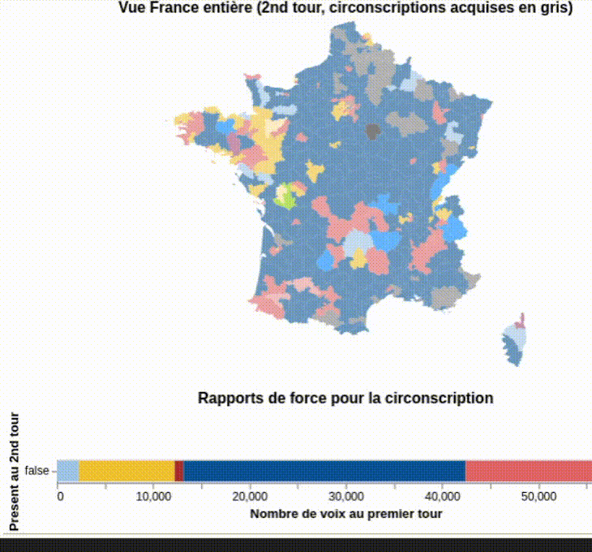
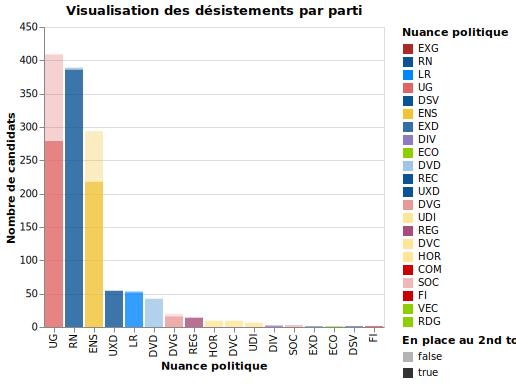
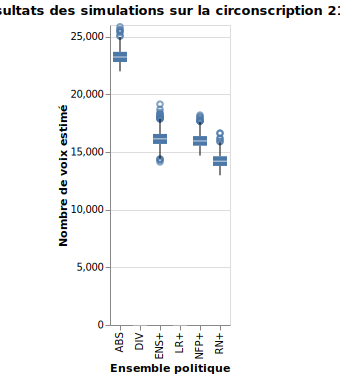

# Analyse des données publiques sur les élections législatives 2024

Ce dépôt propose une **exploration** des données électorales disponibles en _open data_ ainsi qu'une **modélisation simplifiée** des reports de voix afin d'effectuer des projections sur le nombre de sièges.

Toutes les données sont issues du site data.gouv.fr (sous Licence Ouverte).



NOTE : Les projections proposées ne constituent pas des sondages au sens de la loi du 19 juillet 1977 puisque aucun individu n'a été interrogé pour réaliser le modèle.

# Installation

```
python -m venv .venv
./.venv/bin/pip install poetry
poetry install
```
## Utilisation

Actuellement 2 notebooks sont disponibles (dans le dossier `notebooks`) :
- `0-pretraitement.ipynb` qui contient l'essentiel du prétraitement et de la visualisation (les graphiques ne s'affichent pas sur GitHub..)
- `1-modelisation.ipynb` qui s'appuie sur les données prétraitées et propose une modélisation du 2nd tour

### Quelques mots sur la modélisation
L'objectif était de trouver une modélisation la plus simple possible, tout en étant un minimum réaliste. Les paramètres déterminants dans l'estimation des résultats du 2nd tour sont les taux de reports par parti.
Pour simplifier la tâche, seuls 9 taux de report sont estimés comme illustré ci-dessous


où sont regroupés sous les différents sigles : 
- `NFP+` = `UG` + `UDG` + `FI` + `ECO` + `COM` + `EXG`
- `ENS+` = `ENS` + `UDI` + `HOR` + `DVC`
- `LR+`= `LR` + `DVD`
- `RN+` = `RN` + `UXD` + `DSV` + `REC`

Des simulations sont ensuite réalisées en échantillonnant autour de 4 hyperparamètres $\overline{\alpha_1}, \overline{\alpha_2}, \overline{\alpha_3}, \overline{\alpha_4}$ qui pourraient être calibrés à l'aide des résultats des précédentes élections législatives.

Les hyperparamètres choisis sont les suivants


Note : La modélisation est volontairement frugale et s'appuie sur un nombre de paramètres très limité. Par ailleurs la calibration des paramètres pourrait être améliorée

### Exemples de visualisation




#### Sources de données utilisées
- Résultats du 1er tour des législatives 2024
- Candidatures pour le 2nd tour des législatives 2024
- Contour des circonscriptions
- Statistiques socio-démographiques sur les circonscriptions