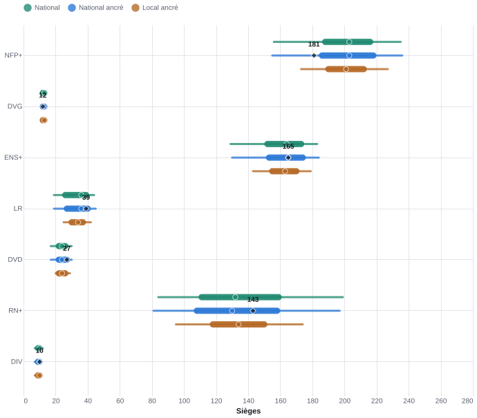
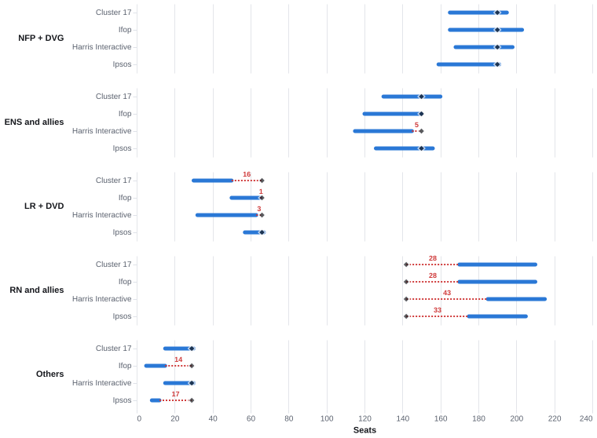
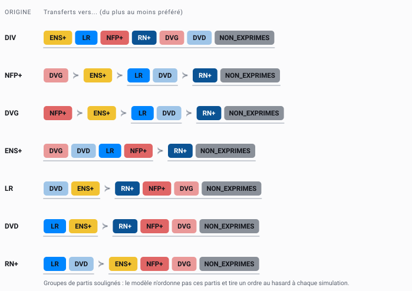
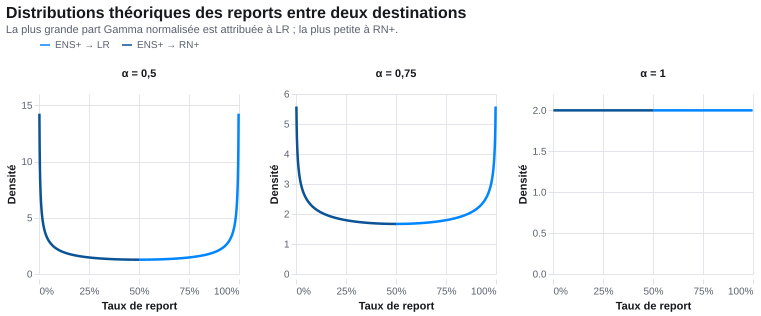
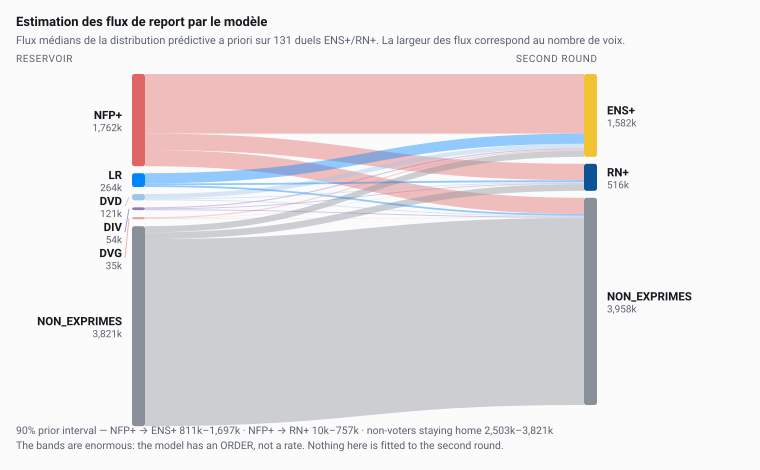
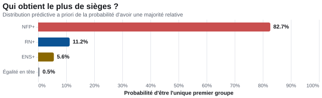
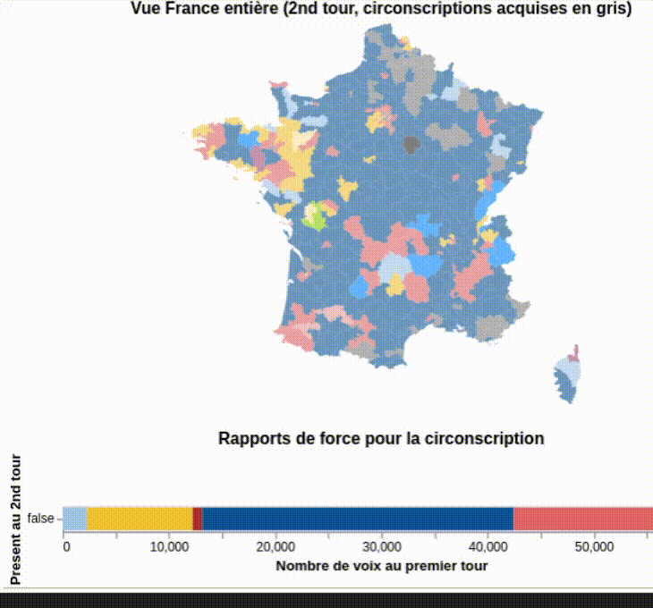

# Prévoir le second tour des législatives 2024 sans sondage

## Description
Un modèle statistique qui projette le nombre de sièges du second tour des élections
législatives de 2024 à partir des **résultats du premier tour** et de la liste des
candidats maintenus. Aucun sondage, aucun résultat d'élection passée, aucun taux de
report fixé à la main.

### Mieux vaut être incertain que faussement précis

Ce modèle essaie de ne reposer que sur des hypothèses très consensuelles et relativement peu d'informations de sorte à avoir des intervalles prédictifs bien calibrés (quitte à avoir des intervalles de confiance assez larges).

**[Lire le billet complet →](https://victor-amblard.gitlab.io/analyse-legislatives-2024)** construction du modèle, hypothèses, résultats et limites.

<picture>
  
</picture>

> Les projections proposées ne constituent pas des sondages au sens de la loi du
> 19 juillet 1977 : aucun individu n'a été interrogé pour réaliser ce modèle.
## Le modèle en un paragraphe

Les voix des candidats éliminés et des non-exprimés du 1er tour sont redistribuées
entre les candidats encore en lice. Le modèle **ne fixe aucun taux de report** : il ne
déclare qu'un **ordre de préférence** entre destinations, et tire les taux
dans la portion du simplexe qui respecte cet ordre. La participation du 2nd tour est
ancrée sur celle du 1er, décalée d'une dérive nationale calibrée sur quatre scrutins.
Deux mille simulations plus tard, on lit la distribution des sièges.

Le détail est [dans le billet](https://victor-amblard.gitlab.io/analyse-legislatives-2024).


## Installation

Python 3.13 ou 3.14.

```bash
uv sync
```

Les commandes ci-dessous s'exécutent alors dans cet environnement, soit en le
préfixant (`uv run pytest`), soit après l'avoir activé (`source .venv/bin/activate`).

Les tables brutes et leur provenance sont dans `data/raw/` (résultats du
ministère de l'intérieur et fourchettes publiées par les instituts), les fichiers géographiques
externes dans `data/external/` et la table prête à simuler dans
`data/processed/`.

## Utilisation

### L'application interactive

```bash
python scripts/reproduce.py  # produit aussi artifacts/app/ pour le déploiement
streamlit run app.py
```

Trois onglets : projection nationale, projection par circonscription, et méthodologie.

### Les scripts

```bash
python scripts/prepare_data.py         # reconstruit data/processed/ depuis data/raw/
python scripts/reproduce.py            # régénère les résultats publiés des trois variantes
python scripts/reproduce.py --figures  # régénère aussi les analyses a priori et les figures
python scripts/reproduce.py --figures --demobilisation-sensitivity  # recalcule la grille sur d
python scripts/reproduce.py --figures --kernel-sensitivity  # recalcule aussi la grille (h, lambda), coûteuse
python scripts/evaluate.py             # couverture et finesse face aux vrais résultats du 2nd tour
python scripts/evaluate.py --model national   # même mesure sur une autre variante
python scripts/analyses/prior_predictive.py     # taux impliqués par les ordres déclarés
python scripts/analyses/diagnostics.py          # erreur Monte-Carlo et variantes
python scripts/analyses/kernel_sensitivity.py   # sensibilité au noyau et au mélange
python scripts/analyses/pollster_benchmark.py   # comparaison avec les instituts
python scripts/analyses/first_round_leader.py   # référence : le qualifié en tête au 1er tour gagne
```

Les résultats du 2nd tour ne servent qu'à l'évaluation des modèles (`evaluate.py`,
`pollster_benchmark.py` et `first_round_leader.py`). Ils n'entrent jamais en compte dans la phase d'étalonnage.

### Vérifications

```bash
pytest        # 267 tests : invariants du modèle, du prétraitement, des métriques
mypy          # typage de src/ et scripts/ (configuration dans pyproject.toml)
ruff check .  # lint : imports morts, pièges d'exécution, tournures dépréciées
black .       # mise en forme
```

`ruff` et `black` se partagent le travail sans se recouvrir : `black` impose la
mise en forme, `ruff` ne fait que du lint (les règles de longueur de ligne lui
sont donc désactivées). La CI lance les deux, plus le démarrage de l'app.

### Depuis Python

```python
from analyse_legislatives import simulation
from analyse_legislatives.data import load_full_results
from analyse_legislatives.models import build
from analyse_legislatives.projections import seats_by_simulation

first_round = load_full_results()
model = build("national_anchored", seed=20240707)

detailed = model.predict_all_circonscriptions(first_round.districts)

# Pour effectuer N=2000 simulations Monte-Carlo
cube = simulation.run(model, first_round.districts, n_simus=2000)
seats = seats_by_simulation(cube, first_round_seats=first_round.first_round_seats)
```


### Adapter le modèle à un autre scrutin ?
Pour un **autre scrutin**, il suffit de fournir un `CirconscriptionResult` par
circonscription (voix du 1er tour + partis encore en lice) ; `models.build` applique
ensuite la configuration du scrutin. Les hypothèses — ordres de préférence, priors,
dérive de participation — sont toutes dans [`config/model.yaml`](config/model.yaml),
et nulle part ailleurs.


## Quelques visuels

**Le point de départ.** Aucun des quatre instituts n'a placé le RN dans sa fourchette,
tous trop haut, de 28 à 43 sièges.



**Tout le contenu du modèle.** Chaque ligne est un groupe d'origine ; les puces vont du
plus au moins préféré. Les puces soulignées sont des ex aequo que le modèle refuse de
départager.



**L'effet de la concentration.** Les densités théoriques d'un partage ordonné à
deux destinations montrent comment une valeur plus faible de $\alpha$ favorise
les reports les plus tranchés.

<picture>
  <source media="(prefers-color-scheme: dark)" srcset="site/public/figures/dirichlet-simplex-dark.svg" />
  
</picture>

**Où vont les voix.** Un tirage illustratif dans la circonscription 0101 : la
largeur est un nombre de voix, ce qui fait ressortir la taille réelle de chaque
réservoir.



**Qui arrive en tête.** Probabilité d'être seul premier groupe en nombre de sièges.

<picture>
  <source media="(prefers-color-scheme: dark)" srcset="site/public/figures/dominant-party-dark.svg" />
  
</picture>



## Architecture du code

| Module | Rôle |
| --- | --- |
| `parties` | Familles politiques, `NON_EXPRIMES`, et l'ordre canonique `DESTINATIONS` |
| `circonscription` | Circonscriptions, résultats du 1er tour, prédictions |
| `data` | Chargement des fichiers du ministère de l'intérieur |
| `transfers` | `TransferMatrix` et sa restriction à une circonscription |
| `models` | Les trois variantes et la fabrique `build()` |
| `models.ordinal` | Le cœur de la méthode : d'un ordre déclaré à des taux de report |
| `simulation` | La boucle Monte-Carlo et les conversions du cube de résultats produit |
| `projections` | Sièges, suffrages exprimés, tableaux par circonscription |
| `config` | Schéma pydantic, lecture et validation de `config/model.yaml` |
| `utils.validation` | Contraintes numériques partagées par le schéma de config et les modèles |
| `utils.progress` | Barre de progression de terminal des boucles Monte-Carlo |
| `viz` | Palette, mise en forme, graphiques, texte de méthodologie |
| `publication` | Génération des figures statiques propres au billet |
| `evaluation` | Métriques prédictives partagées par les scripts |
| `baselines` | Règles de référence déterministes, sans aucun report de voix |

### Où sont les hypothèses

Les six hypothèses numérotées du billet ([`writeup.fr.md`](writeup.fr.md)) sont
signalées en commentaire dans le code, à l'endroit exact où elles agissent :

| hypothèse | modèle | implémentation |
| --- | --- | --- |
| 1 — abstentions, blancs et nuls forment une seule catégorie | tous | `data.load_full_results` |
| 2 — les reports ne sont contraints que par un ordre (partiel) déclaré |  tous | `models.ordinal`, ordres dans `config/model.yaml` |
| 3 — un électeur d'un qualifié se démobilise ou revient, jamais ne bascule pour un autre parti | tous | `transfers.normalize_for_district` |
| 4 — la mobilisation est proportionnelle au réservoir des non-exprimés (uniquement pour le modèle simple) | `national` |  `transfers._non_expressed_row`, assouplie par `models.expressed_anchored` |
| 5 — absence de variations locales | `national` |`models.national` |
| 6 — corrélations locales approchées par le 1er tour | `kernel_anchored` |  `models.kernel` |

Les hypothèses 3 et 4 vivent dans `transfers` et non dans `models`.

Une simulation se lit en trois temps — le hasard national d'abord
(`SimulationParameters`), puis les lignes de report par circonscription, puis la
fermeture des matrices. Le diagramme d'héritage et le détail des trois étapes
sont en tête de `models/__init__.py` ; `models/ordinal.py` isole le cœur de la
méthode, sans dépendance au reste.

| Variante | Ce qu'elle ajoute |
| --- | --- |
| `national` | une seule matrice de report pour toutes les circonscriptions |
| `national_anchored` | + participation ancrée sur celle du 1er tour **(défaut)** |
| `kernel_anchored` | + variation locale corrélée entre circonscriptions semblables |

## Sources

Résultats du 1er tour et candidatures du 2nd tour des législatives 2024, contours des
circonscriptions et statistiques socio-démographiques — tous issus de
[data.gouv.fr](https://www.data.gouv.fr/) sous Licence Ouverte.

## Organisation du dépôt

```text
config/                 hypothèses scientifiques et regroupement des partis
data/raw/               fichiers électoraux et autres tables sources d'origine
data/external/          données externes, notamment géographiques
data/processed/         table déterministe consommée par le modèle (voir scripts/prepare_data.py)
src/analyse_legislatives/ logique scientifique réutilisable
scripts/                reproduction et évaluation
scripts/analyses/       diagnostics et analyses de sensibilité
artifacts/publication/  résultats numériques qui alimentent le billet
site/public/figures/    SVG effectivement publiés
research/               analyses rétrospectives, hors modèle de prévision
tests/                  tests
```

Les fichiers de `artifacts/publication/` et `site/public/figures/` sont des sorties
publiables conservées pour rendre le billet vérifiable. 
Les anciens notebooks et visuels ont été
déplacés dans `archive/`, où ils restent visibles mais séparés du code actif.

## Licence
Le dépôt est publié sous [Licence Ouverte 2.0](LICENSE).
